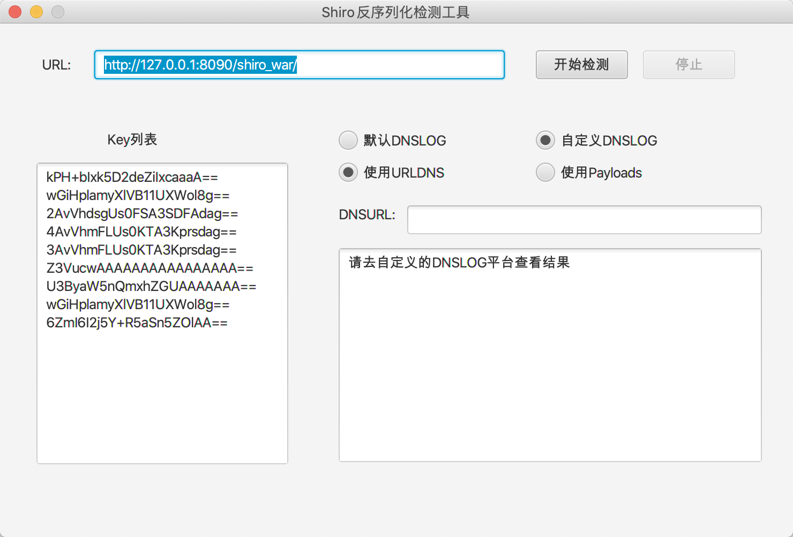

## Shiro反序列化检测工具

用于检测存在Shiro反序列化漏洞的key值。有两种方式进行检测，一种是利用URLDNS进行检测，第二种利用命令执行进行检测。



### 功能简介

- 默认DNSLOG

选择后会调用`dnslog.cn`的接口，生成一个域名，进行检测后，结果会输出在结果区域。

> 选择该选项时，会有卡顿，正在从`dnslog.cn`获取域名，并显示。

- 自定义DNSLOG

需要自己输入一个dnslog地址，进行检测后去输入的dnslog平台去查看结果

- 使用URLDNS

利用URLDNS进行检测。

参考：https://github.com/LuckyC4t/shiro-urldns/blob/master/src/main/java/luckycat/shirourldns/URLDNS.java

- 使用payloads

通过执行`ping`命令来检测。

### 使用

```
git clone https://github.com/fupinglee/ShiroScan
cd ShiroScan
mvn clean package -DskipTests=true
```

打开target下的jar文件即可执行

### 运行效果

使用`默认DNSLOG+URLDNS`进行检测


使用`自定义DNSLOG+URLDNS`进行检测


使用`默认DNSLOG+Payloads`检测


> 这里使用的命令是`ping key.substring(0,3)+"."+payload+"."+"dnslog.cn"`

使用`自定义DNSLOG+Payloads`检测


### 参考

https://github.com/wh1t3p1g/ysoserial

https://github.com/frohoff/ysoserial

https://github.com/LuckyC4t/shiro-urldns/blob/master/src/main/java/luckycat/shirourldns/URLDNS.java

### 其他

**仅供安全人员进行有授权的验证,勿用于非法测试**

