## Shiro反序列化检测工具

**ShiroScan**用于检测存在Shiro反序列化漏洞的key值。有三种方式进行检测，第一种是利用URLDNS进行检测，第二种利用命令执行进行检测，第三种使用`SimplePrincipalCollection`序列化后进行检测（XCheck，即Xray Check）。

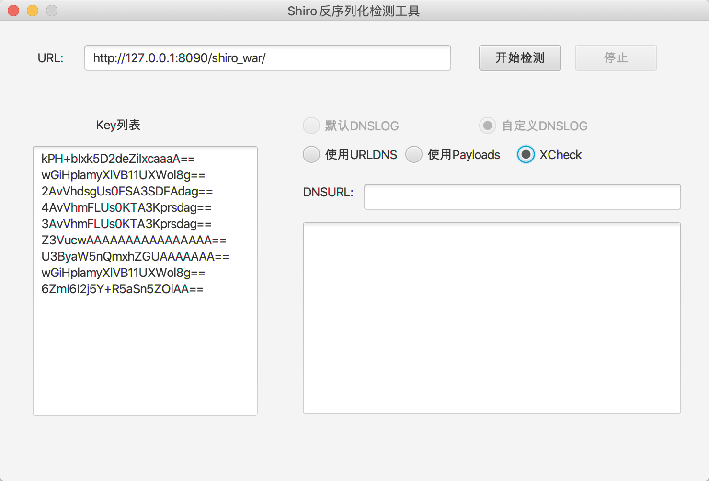

### 功能简介

- 默认DNSLOG

选择后会调用`dnslog.cn`的接口，生成一个域名，进行检测后，结果会输出在结果区域。

> 选择该选项时，会有卡顿，正在从`dnslog.cn`获取域名，并显示。

- 自定义DNSLOG

需要自己输入一个dnslog地址，进行检测后去输入的dnslog平台去查看结果

- 使用URLDNS

利用URLDNS进行检测。

参考：https://github.com/LuckyC4t/shiro-urldns/blob/master/src/main/java/luckycat/shirourldns/URLDNS.java

- 使用payloads

通过执行`ping`命令来检测。

- 使用XCheck

通过使用`SimplePrincipalCollection`序列化来进行检测，key正确情况下不返回 **deleteMe** ，key错误情况下返回 **deleteMe** 。

参考：https://mp.weixin.qq.com/s/do88_4Td1CSeKLmFqhGCuQ

### 使用

1.自行打包使用

```bash
git clone https://github.com/fupinglee/ShiroScan
cd ShiroScan
mvn clean package -DskipTests=true
```

打开target下的jar文件即可执行

2.直接下载使用

https://github.com/fupinglee/ShiroScan/releases

### 运行效果

- 使用`默认DNSLOG+URLDNS`进行检测

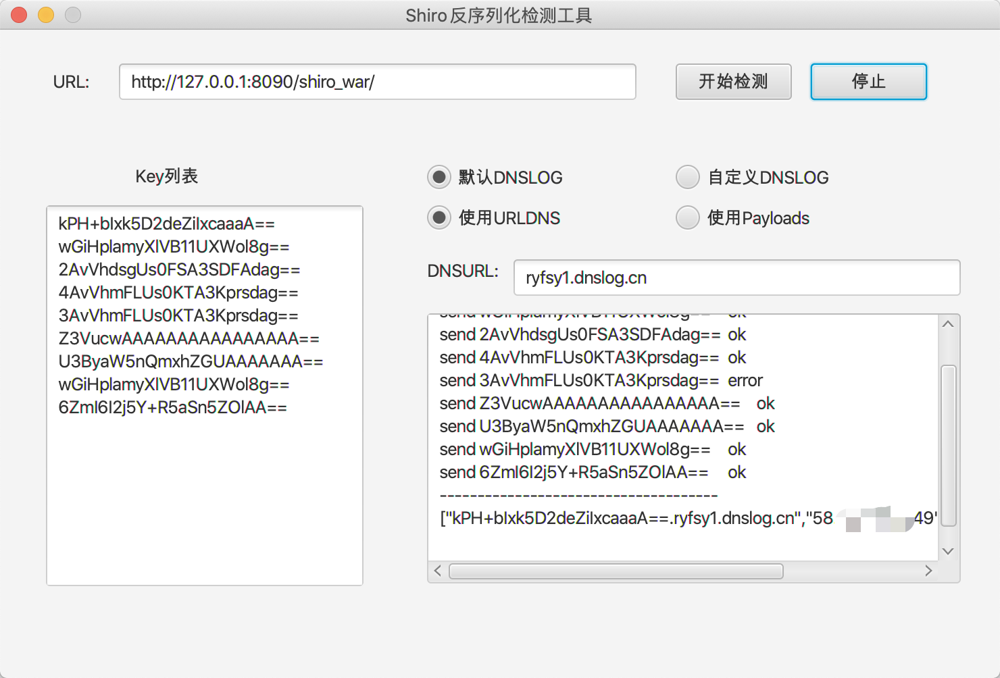

- 使用`自定义DNSLOG+URLDNS`进行检测

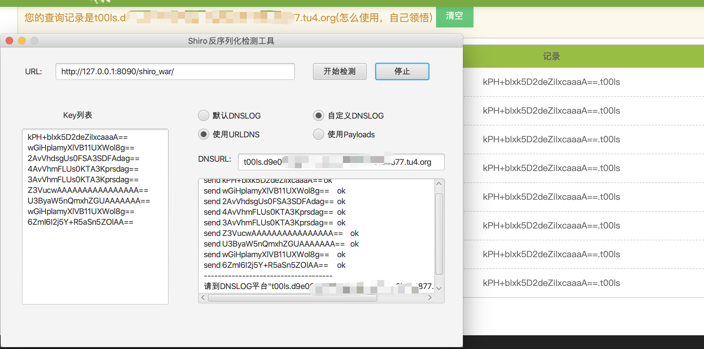

- 使用`默认DNSLOG+Payloads`检测


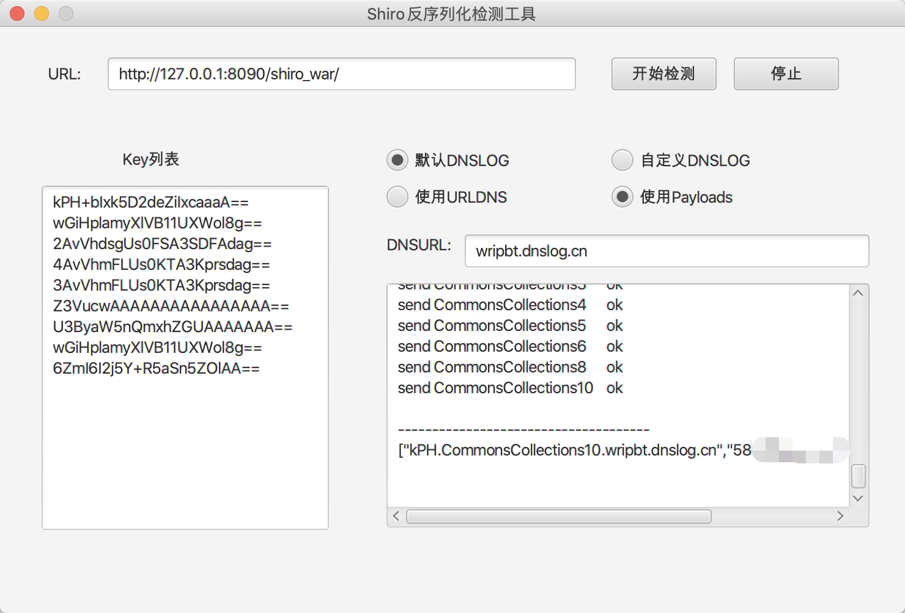

> 这里使用的命令是`ping key.substring(0,3)+"."+payload+"."+"dnslog.cn"`

- 使用`自定义DNSLOG+Payloads`检测


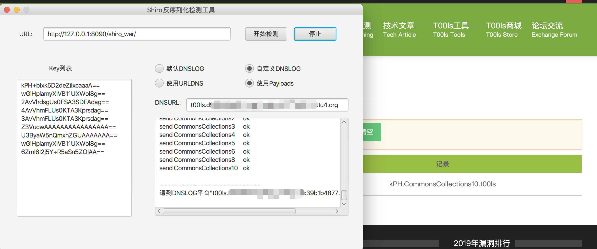

- 使用XCheck进行检测

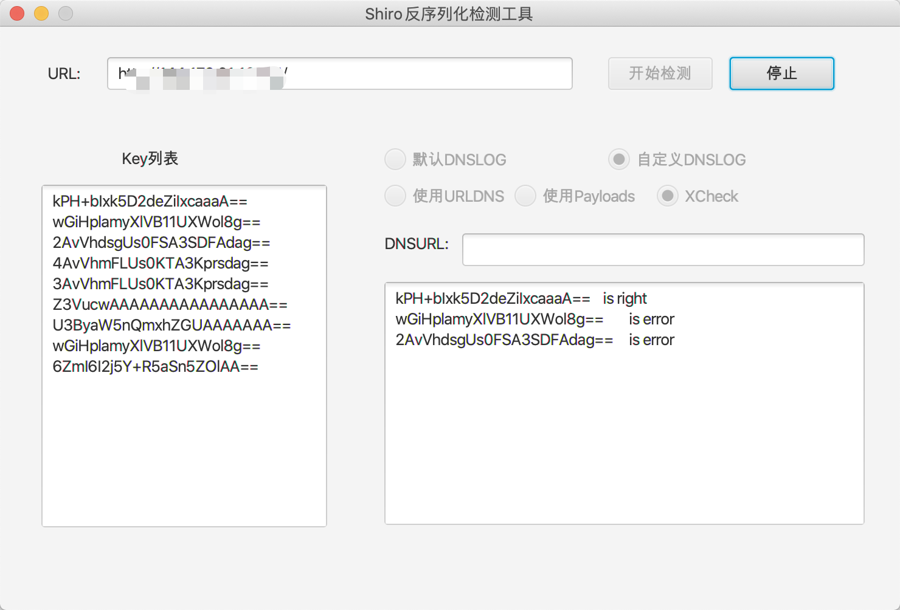


# Shiro反序列化回显工具

### 简介

**ShiroExploit**是Shiro反序列化检测与回显利用工具，ShiroScan是从其中剥离出来的。当前版本v2.3。

https://github.com/fupinglee/JavaTools/tree/master/Shiro#v23

- 支持Tomcat7、8、9下CMD内存shell的写入与卸载，支持Tomcat6、7、8、9下的通用回显。
- 支持Tomcat7、8、9以及SpringBoot下冰蝎内存shell的写入与卸载。

### 使用

直接下载使用

1.https://github.com/fupinglee/ShiroScan/releases/tag/v1.1 选择v2.3版本

2.https://github.com/fupinglee/JavaTools/tree/master/Shiro#v23

### 运行效果

#### **1.回显**

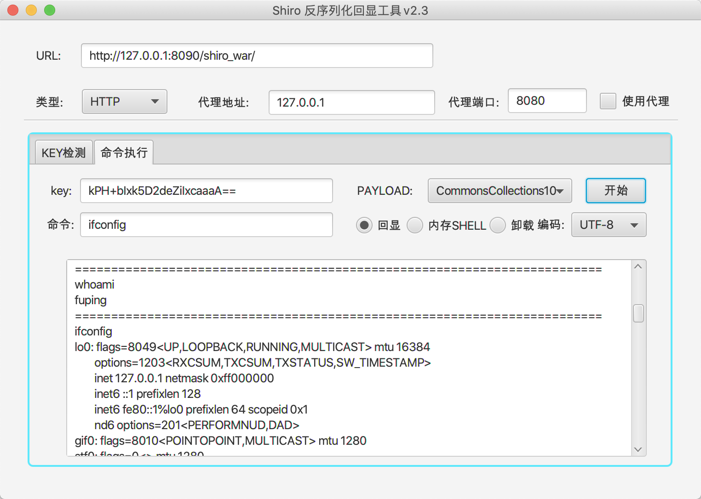


#### **2.内存Shell**


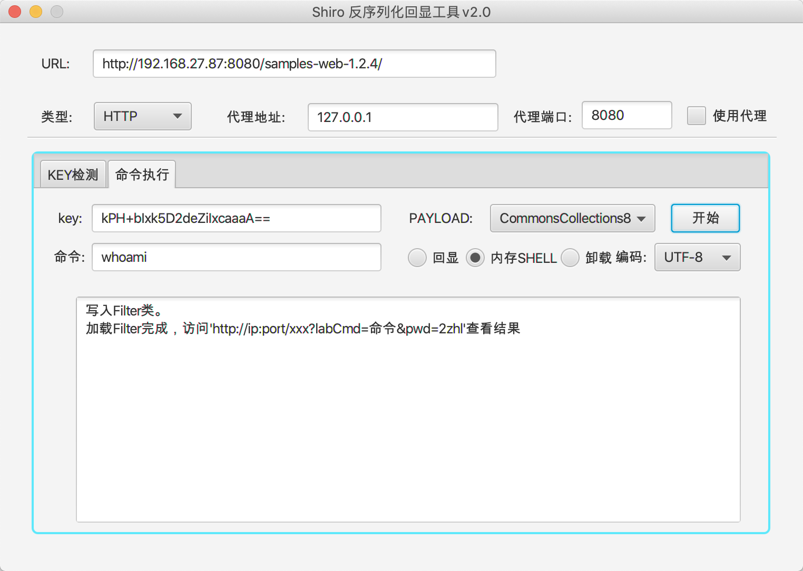

使用正确的密码，会执行命令，错误的密码返回正常页面。

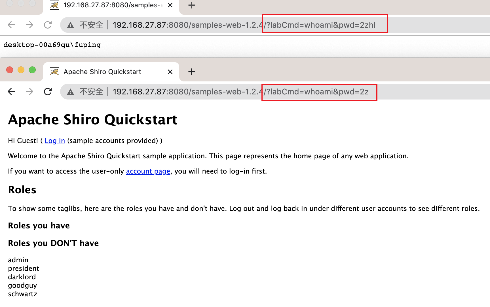


**SpringBoot环境下写入冰蝎Shell**

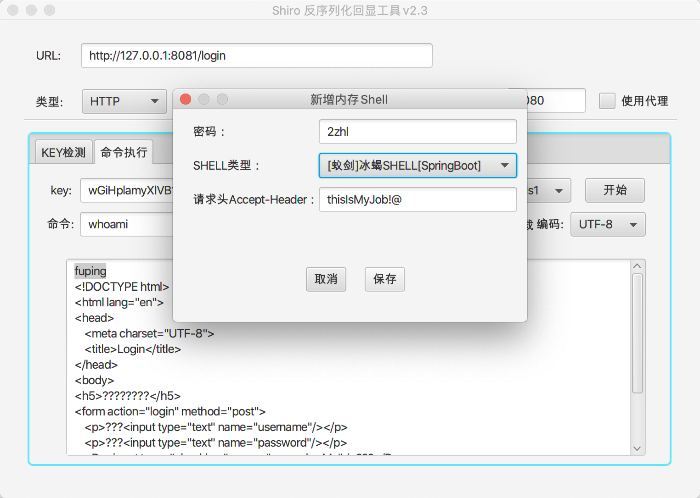

**使用蚁剑连接**

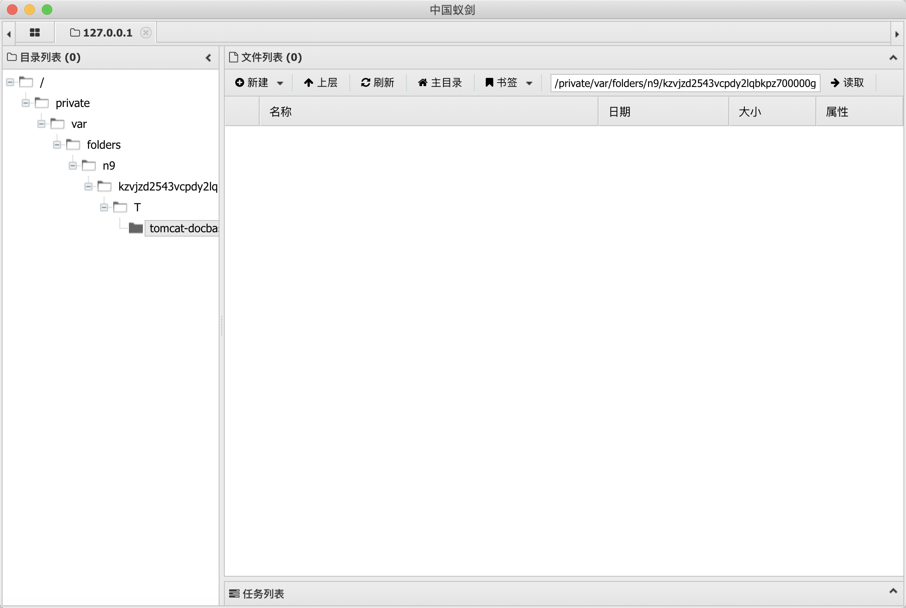


更多使用说明参考:https://github.com/fupinglee/JavaTools/blob/master/Shiro/使用说明-v2.3.pdf

> **使用时需要先确定Key和所使用的Gadget，然后加载内存shell。**


## 参考

https://github.com/wh1t3p1g/ysoserial

https://github.com/frohoff/ysoserial

https://github.com/LuckyC4t/shiro-urldns/blob/master/src/main/java/luckycat/shirourldns/URLDNS.java

https://mp.weixin.qq.com/s/do88_4Td1CSeKLmFqhGCuQ

https://github.com/zema1/ysoserial/[通用回显]

## 其他

**仅供安全人员进行有授权的验证,勿用于非法测试**

